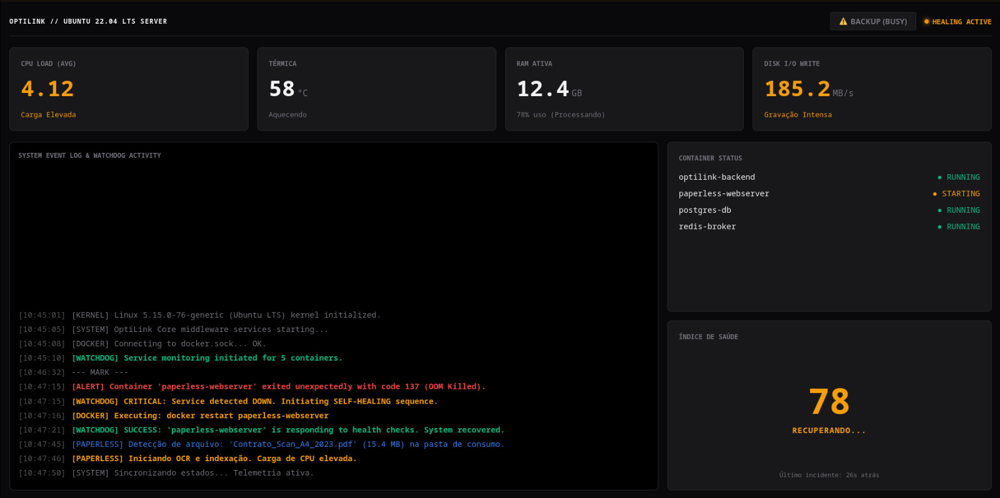

<div align="center">
    
  <h1>OptiLink Core</h1>
  
  <h3>Controle e Telemetria para Home Lab (OptiPlex 7020)</h3>

  <p>
    
    
    
    
  </p>
</div>

---

## Visão Geral

O **OptiLink** é o sistema que eu criei para gerenciar meu homelab (um OptiPlex 7020 rodando Ubuntu Server LTS). 

Eu não queria instalar um monte de coisas pesadas como Prometheus ou Grafana só para saber se meu Paperless estava rodando. Queria algo leve, que falasse direto com o Kernel e que me deixasse dormir tranquilo sabendo que, se um container cair, o sistema levanta ele sozinho.
App mobile pra upload de arquivos a caminho

> "Monitoramento direto da veia do Linux (`/proc`), sem intermediários."

---

## O que ele faz?

| Recurso | Descrição |
| :--- | :--- |
| **🔎 Leitura de Hardware** | Lê direto de `/proc/meminfo` e `/proc/loadavg`. Zero overhead, resposta imediata. |
| **🐕 Docker Watchdog** | Vigia meus containers. Se o Nginx ou Paperless caírem, ele reinicia sozinho em 5 segundos. |
| **⚠️ Botão de Pânico** | Um gatilho remoto que força o Docker a rodar o exportador de backup do Paperless-ngx. |
| **📱 Matrix Dashboard** | Interface Web (e Mobile) escura, estilo terminal, que recebe dados via WebSockets (SignalR). |

---

## Interface (The Forge)

### Dashboard Web "Matrix"
*Monitoramento em tempo real de CPU, RAM e status dos serviços.*


---

## Arquitetura do Sistema

O backend roda "headless" no Arch e gerencia tudo via sockets e leitura de arquivos do sistema.

```mermaid
graph TD
  A[Linux Kernel /proc] -->|Status Bruto| B(OptiLink Backend .NET 10)
  C[Docker Socket] <-->|Monitora & Reinicia| B
  B -->|Stream via SignalR| D[Web Dashboard]
  B -->|Stream via SignalR| E["App Android (Kotlin)"]
  
  D -.->|Gatilho de Backup| B
  B -.->|Executa Exporter| C

